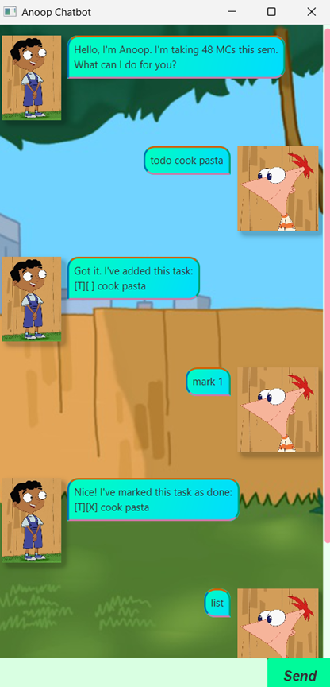

# Anoop Chatbot User Guide

## Overview

---

Anoop Chatbot is a desktop chatbot application with a chat-style GUI that helps users manage tasks efficiently.
Features simple, intuitive interface, cross-platform support (Windows, macOs, Linux) and a charismatic personality :)


> "I'm simply... the goat" - Anoop 

## Quick start

---

1. Ensure you have Java 17 or newer versions installed.
**Mac Users:** Ensure you have the correct JDK version as shown [here](https://se-education.org/guides/tutorials/javaInstallationMac.html)

2. Download the latest ```.jar``` from the [releases page]().
3. Place the ```.jar``` file in a folder for your application and open a terminal.
4. Run ```java -jar Duke.jar```

## Features

---

Anoop Chatbot supports adding ```todo```, ```deadline``` and ```event``` tasks. Each task has unique parameters with a ```description``` and an ```isDone``` status. Support for ```find```, ```mark```, ```unmark``` and ```delete``` for these tasks is available.

Use ```list``` to browse current tasks, ```help``` for command list and ```bye``` to close the application.
### Adding a ToDo type task: ```todo```

Adds a ```todo``` task to the current task list. A ```todo``` task consists of only a ```Description```.

Format: ```todo TASK_DESCRIPTION```

Example: ```todo cook pasta```, ```todo study for exams```

### Adding a Deadline type task: ```deadline```

Adds a ```deadline``` task to the current task list. A ```deadline``` task consists of a ```Description``` as well as a ```by``` deadline.

Format: ```deadline TASK_DESCRIPTION /by DEADLINE_TIME (DD-MM-YYYY HH:mm)```

Example: ```deadline do homework /by 16-04-2023 14:30```

Example: ```deadline bake cookies /by 06-10-2025 08:55```

### Adding an Event type task: ```event```

Adds an ```event``` task to the current task list. An ```event``` task consists of a ```Description```, a ```from``` starting time and a ```to``` ending time.

Format: ```event TASK_DESCRIPTION /from START_TIME (DD-MM-YYYY HH:mm) /to END_TIME (DD-MM-YYYY HH:mm)```

Example: ```event dinner party /from 25-12-2025 18:00 /to 25-12-2025 23:00```

Example: ```event career far /from 08-08-2026 10:00 /to 09-08-2026 14:00```

### Show all current tasks: ``` list```
Displays the currents list of tasks. Each task includes their completion status, task type and date/time parameters if applicable.

Format: ```list```

### Mark a task: ```mark```
Mark a task as complete.

Format: ```mark TASK_NUMBER```

Example: ```mark 1``` marks the current first task on the list as complete.
To view task numbers, use ```list```.

### Unmark a task: ```unmark```
Mark a task as incomplete.

Format: ```unmark TASK_NUMBER```

Example: ```unmark 2``` marks the current second task on the list as incomplete.
To view task numbers, use ```list```.

### Delete a task: ```delete```
Remove a task from current task list.

Format: ```delete TASK_NUMBER```

Example: ```delete 3``` deletes the current third task on the task list.
To view task numbers, use ```list```.

### Find a task: ```find```
Displays a list of tasks matching the query.

Format: ``` find TASK_NAME```

Example: ```find study``` returns tasks ```study for midterms``` and ```study for finals```.

### Viewing help: ```help```
Displays a message containing all available chatbot commands.

Format: ```help```

### Exit the application: ```bye```
Closes the chatbot application and saves current state of task list.

Format: ```bye```

## Acknowledgements:

---
Code reuse credit: @omgeta and @lemonishi on GitHub

README adapted from [AB3 User Guide](https://se-education.org/addressbook-level3/UserGuide.html#viewing-help--help)
